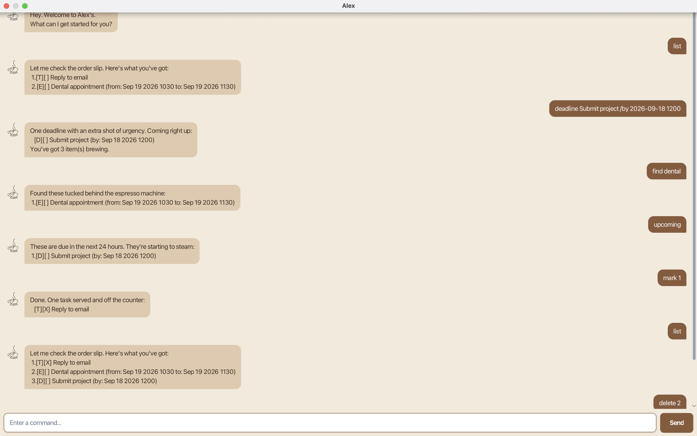

# Alex User Guide

**Alex** is a desktop chatbot that helps you keep track of todos, deadlines, and events using short text commands. Alex has the personality of a mildly bored coffee-shop barista, serving useful answers with a touch of dry humor. Alex saves your changes automatically, so your tasks are waiting for you the next time you open the app.

## Quick start

1. Install Java 25.
2. Place the provided `alex.jar` file in the folder where you want Alex to keep its data.
3. Open a terminal in that folder and run `java -jar alex.jar`.
4. Type a command in the box at the bottom of the window, then press <kbd>Enter</kbd> or select **Send**.

Try `todo reply to email`, followed by `list`.

## Command basics

- Enter command words in lowercase.
- Words in `UPPER_CASE` are values for you to replace. For example, use `todo reply to email` instead of `todo DESCRIPTION`.
- Items in square brackets are optional. Dates use `yyyy-MM-dd`; optional times use the 24-hour `HHmm` format. For example, `2026-09-20 1830` means 20 September 2026 at 6:30 pm.
- Task numbers come from `list` and start at 1. Results from `find` and `upcoming` are numbered for display only; always use the number shown by `list` with `mark`, `unmark`, or `delete`.
- `[T]`, `[D]`, and `[E]` identify todos, deadlines, and events. `[ ]` means incomplete and `[X]` means complete.
- Task descriptions cannot contain the `|` character.

## Features

### Add a todo: `todo`

Adds a task without a date.

Format: `todo DESCRIPTION`

Example: `todo reply to email`

### Add a deadline: `deadline`

Adds a task that must be completed by a particular date and, optionally, time.

Format: `deadline DESCRIPTION /by DATE [TIME]`

Examples:

- `deadline submit report /by 2026-09-20`
- `deadline submit report /by 2026-09-20 1830`

### Add an event: `event`

Adds an event with a start and end. The end must be later than the start. Without a time, `/from` means the start of the day and `/to` means the end of the day, so a date-only event can start and end on the same date.

Format: `event DESCRIPTION /from DATE [TIME] /to DATE [TIME]`

Examples:

- `event orientation /from 2026-09-20 /to 2026-09-21`
- `event workshop /from 2026-09-20 /to 2026-09-20`
- `event team meeting /from 2026-09-20 1400 /to 2026-09-20 1530`

### View all tasks: `list`

Shows every task and its task number, type, and completion status.

Format: `list`

### View upcoming deadlines: `upcoming`

Shows incomplete deadlines due between now and the next 24 hours. Todos, events, completed deadlines, and overdue deadlines are not shown. A deadline without a time is treated as due at the end of its date.

Format: `upcoming`

### Find tasks: `find`

Shows tasks whose descriptions contain the search text. The search is case-insensitive and also matches part of a word.

Format: `find SEARCH_TEXT`

Example: `find report` matches both `submit report` and `review reporting notes`.

### Mark a task as complete: `mark`

Marks the task at the specified number as complete.

Format: `mark TASK_NUMBER`

Example: `mark 2`

### Mark a task as incomplete: `unmark`

Marks the task at the specified number as incomplete again.

Format: `unmark TASK_NUMBER`

Example: `unmark 2`

### Delete a task: `delete`

Permanently removes the task at the specified number.

Format: `delete TASK_NUMBER`

Example: `delete 2`

> [!TIP]
> Run `list` immediately before changing or deleting a task so that you use its current task number.

### Exit Alex: `bye`

Closes Alex.

Format: `bye`

## Saving your tasks

Alex automatically saves every successful add, mark, unmark, and delete operation to `data/alex.txt`, relative to the folder from which you started the app. You do not need to save manually.

Avoid editing this file by hand. If it contains invalid data, Alex cannot load your tasks until you repair or remove the file and restart the app.

## Command summary

| Action | Command | Example |
| --- | --- | --- |
| Add a todo | `todo DESCRIPTION` | `todo reply to email` |
| Add a deadline | `deadline DESCRIPTION /by DATE [TIME]` | `deadline submit report /by 2026-09-20 1830` |
| Add an event | `event DESCRIPTION /from DATE [TIME] /to DATE [TIME]` | `event meeting /from 2026-09-20 1400 /to 2026-09-20 1530` |
| View all tasks | `list` | `list` |
| View deadlines due within 24 hours | `upcoming` | `upcoming` |
| Find tasks | `find SEARCH_TEXT` | `find report` |
| Mark a task complete | `mark TASK_NUMBER` | `mark 2` |
| Mark a task incomplete | `unmark TASK_NUMBER` | `unmark 2` |
| Delete a task | `delete TASK_NUMBER` | `delete 2` |
| Exit Alex | `bye` | `bye` |
